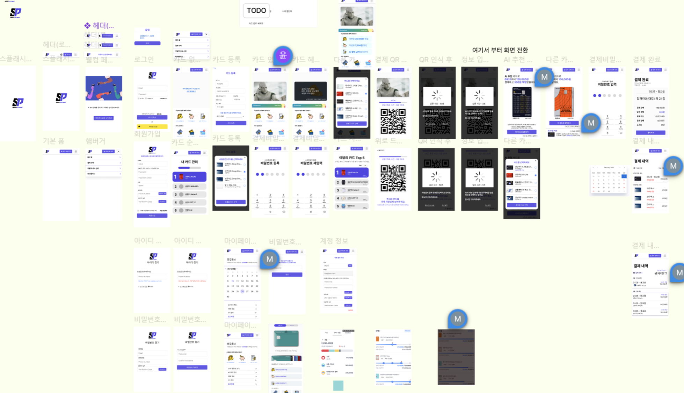
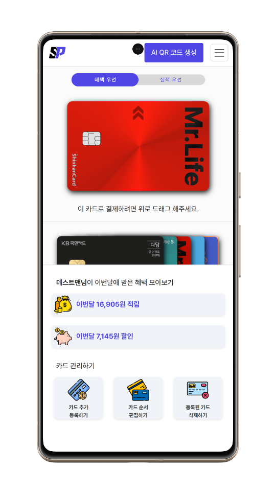
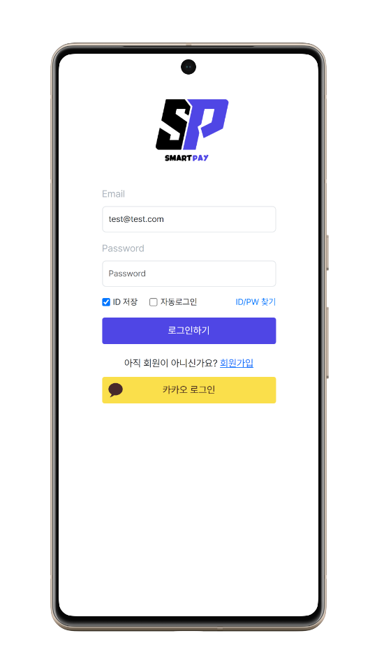
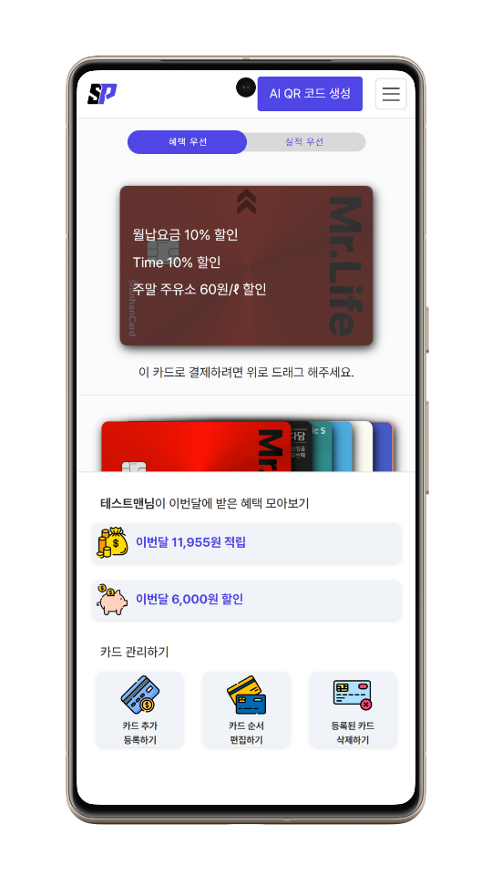
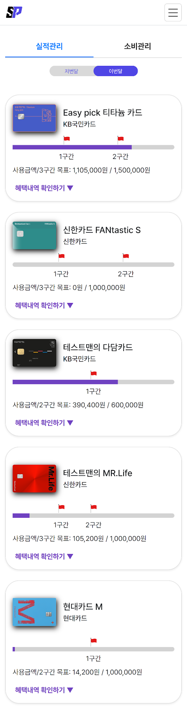
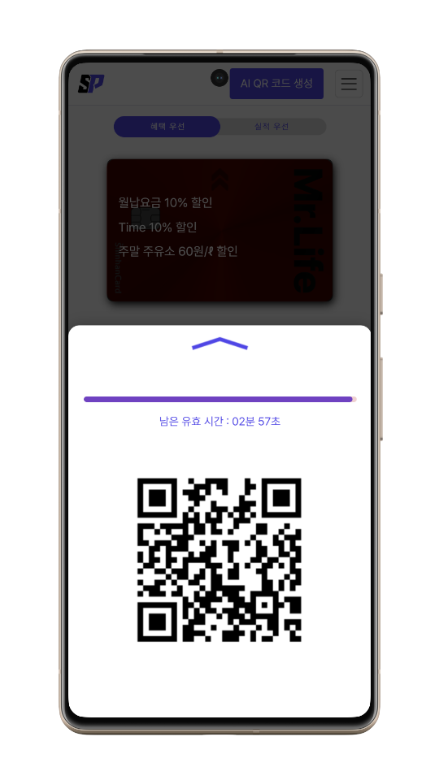
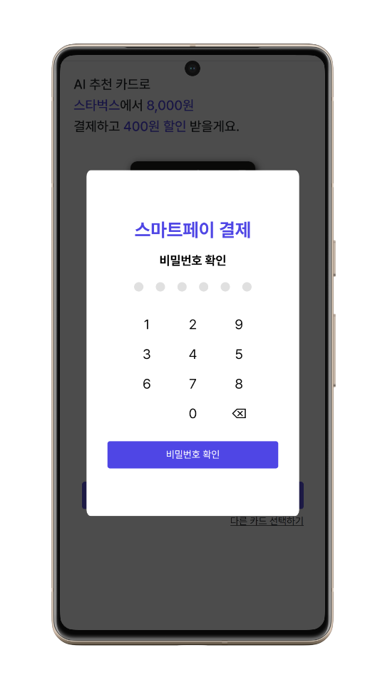
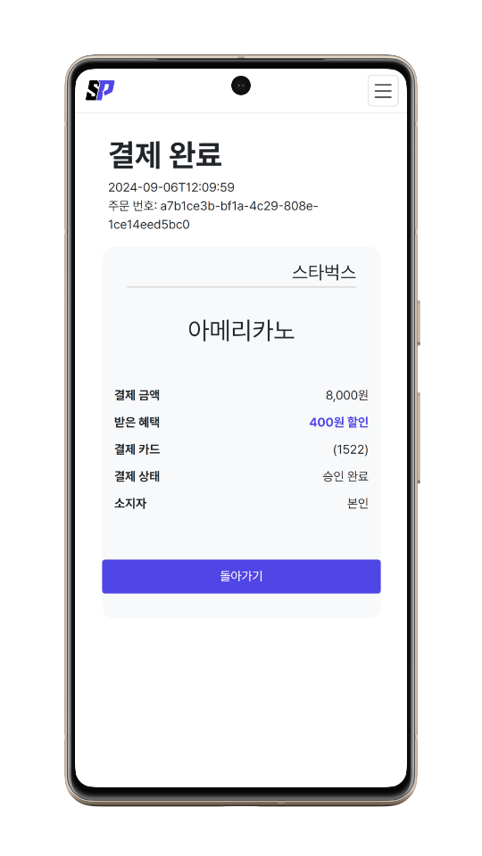
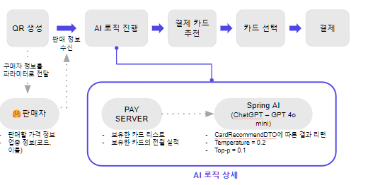

# Front-Smartpay

## 목차
1. [프로젝트 목표](#1-프로젝트-목표)
2. [프로젝트 설명](#2-프로젝트-설명)

## 1. 프로젝트 목표

### (1) 배경
- 소비자는 다양한 카드사의 다양한 카드 상품을 가진다
- 소비자는 자신의 결제 형태에 맞는 최적의 카드를 탐색하기 어렵다 
- 소비자들의 사소한 경제적 이익을 극대화하고자 하는 욕구가 증가하고 있다 
- Open AI API등 고성능 AI 모델의 접근성 확대
- 현대 소비자들은 간편하고 직관적인 사용자 경험을 선호한다. 

### (2) 목표
- 사용자에게 최적의 카드를 추천하여 결제 혜택을 극대화할 수 있도록 한다.
- 복잡한 카드 혜택 정보를 간단하고 직관적으로 제공한다. 
- AI와 고객별 결제 내역을 활용한 개인화된 맞춤형 서비스 제공한다.
- 단순하고 편리한 UI를 통해 만족도 높은 서비스를 제공한다.

## 2. 프로젝트 설명

### (1) 화면명세서

### (2) 메인페이지

### (3) 로그인

- OAuth를 이용한 소셜로그인(카카오)  
  
    

### (4) 카드혜택 정보
 | 
 --- | --- |

- 메인페이지에서는 최대 3가지 혜택 정보 제공
- 카드 실적관리는 구간별 목표실적 관리
- 카드 소비관리는 카테고리별 혜택 내역 확인
 

### (5) 결제

 |  |  |   | 
--- | --- | --- | --- | 

- 웹소켓 통신을 이용한 사용자와 판매자간의 Stateful 통신
- 페이 서비스와 통신하는 별도의 카드사 서버 구축으로 결제 유효성 검사 
- BIN 데이터를 이용한 카드등록시 카드사 자동완성 기능 

### (6) AI 프로세스
