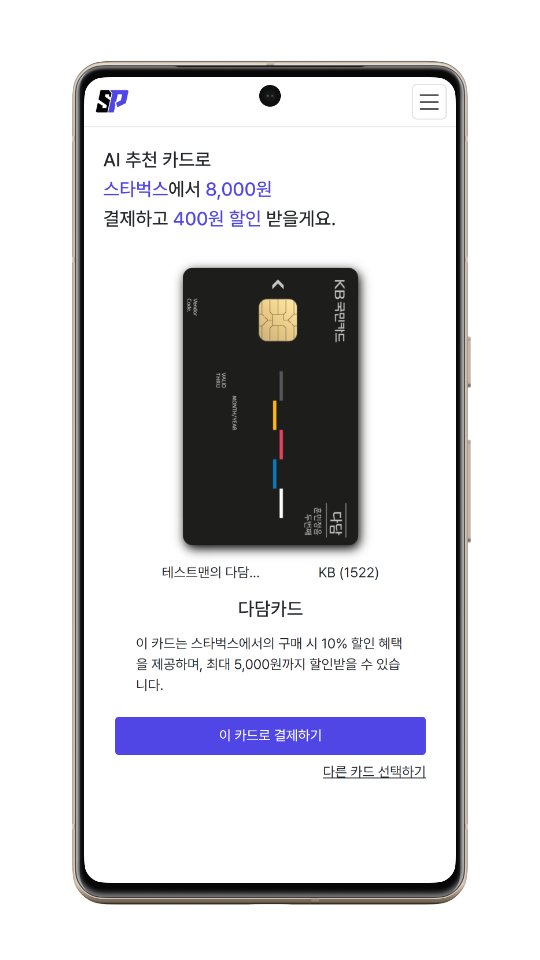

# Front-Smartpay

  

  

  

  

## 목차
1. [프로젝트 목표](#1-프로젝트-목표)
2. [프로젝트 설명](#2-화면-설명)

## 1. 프로젝트 목표

### (1) 배경

- PLCC가 늘어남(*PLCC란, 혜택의 범위를 좁히고 할인률을 높인 카드)
- 모든 영역에서 혜택을 주는 만능 카드가 없다.
- 소비자는 각 카드의 특화된 혜택을 직접 비교해서 사용해야 한다.
- Open AI API등 고성능 AI 모델의 접근성 확대되고 있다.
### (2) 목표
- 사용자에게 최적의 카드를 추천하여 자동으로 혜택과 실적을 제공한다.
- 복잡한 카드 혜택 정보를 간단하고 직관적으로 제공한다. 
- AI와 고객별 결제 내역을 활용한 개인화된 맞춤형 서비스 제공한다.
- 단순하고 편리한 UI를 통해 만족도 높은 서비스를 제공한다.

## 2. 화면 설명

| 화면명세서  |
|--|
|  |

| 메인페이지 |
|--|
|  |

| 로그인 |
|--|
||

- OAuth를 이용한 소셜로그인(카카오)  
  

| 카드혜택정보 | 카드실적관리 |
 --- | --- |
 | 

- 메인페이지에서는 최대 3가지 혜택 정보 제공
- 카드 실적관리는 구간별 목표실적 관리
- 카드 소비관리는 카테고리별 혜택 내역 확인
 

| QR생성 | AI추천 | 결제비밀번호 | 결제완료 |
| --- | --- | --- | --- | 
|  |  |  |   | 

- 웹소켓 통신을 이용한 사용자와 판매자간의 Stateful 통신
- 업종, 상품명, 실적 및 혜택DB 정보를 바탕으로 AI 결제카드 추천
- 페이 서비스와 통신하는 별도의 카드사 서버 구축으로 결제 유효성 검사 

| AI 프로세스 |
|--|
|  |
